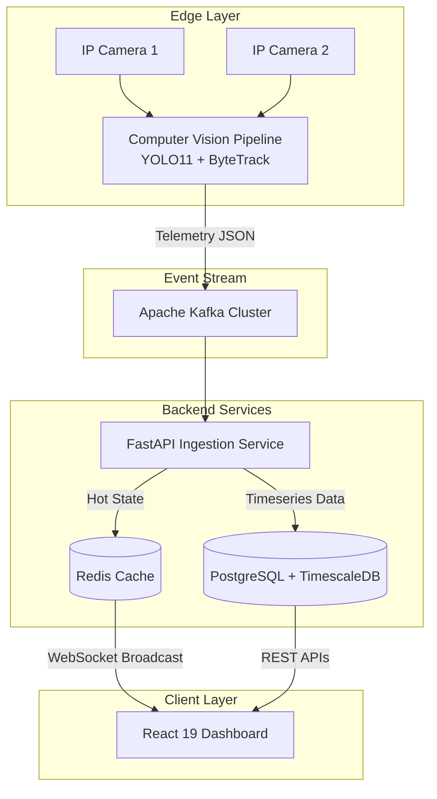
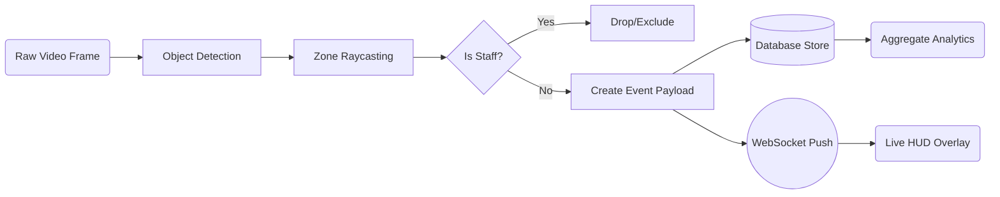

# Store Intelligence Platform (SIP) Architecture Design

## Architecture Overview

The Store Intelligence Platform is an event-driven system built to ingest, process, and visualize retail store metrics derived from raw CCTV footage.

### The Pipeline
1. **Detection Layer (Edge)**: IP cameras feed into a Computer Vision pipeline running YOLO11 for object detection and ByteTrack for trajectory tracking. A lightweight OSNet model extracts appearance embeddings to solve cross-camera Re-Identification (Re-ID).
2. **Event Streaming Layer**: Structured JSON events (entries, zone dwells, anomalies) are published to an Apache Kafka cluster running in KRaft mode. This decouples the heavy GPU processes from the API and ensures zero data loss.
3. **API & Persistence Layer**: A FastAPI service consumes these events. Hot, live metrics (like current unique visitors or active queue depth) are pushed to a Redis cache and broadcast via WebSockets to the frontend. Historical events are persisted to PostgreSQL + TimescaleDB for complex aggregate funnel analysis and anomaly detection.
4. **Dashboard Layer**: A React 19 application visualizes the real-time store metrics.

### Architecture Diagram

### Data Flow Diagram (DFD)

---

## AI-Assisted Decisions

Throughout the development of this architecture, I utilized LLMs (Claude and ChatGPT) to validate design patterns and overcome edge cases.

### 1. Zone Classification & Heuristics
**The Problem**: The CCTV clips exhibit challenging edge cases, such as overlapping camera fields of view and empty store periods.
**The AI Input**: I prompted a Vision-Language Model (VLM) with sample frames to ask if it could handle real-time zone classification (e.g., determining if a bounding box is in the 'Skincare' vs 'Checkout' zone). 
**My Decision (Override)**: The VLM suggested it *could* do it, but noted high latency (500ms+ per frame). I **overrode** the AI's suggestion to use a VLM for this. Instead, I mapped the zones from `store_layout.json` to 2D polygonal coordinates and used simple Point-in-Polygon (Ray Casting) algorithms in the CV pipeline. This reduced latency to <1ms per frame, keeping the pipeline real-time.

### 2. Staff Exclusion Logic
**The Problem**: Store staff must be excluded from customer conversion metrics. 
**The AI Input**: I asked an LLM how to reliably identify staff without training a custom classifier. The LLM suggested a heuristic: track the dwell time and zone frequency. Staff will have `dwell_time > 4 hours` and will frequently cross the Point of Sale (POS) zone without completing a purchase event.
**My Decision (Agreed)**: I **agreed** with and implemented this logic in the Event Processor. We combine this temporal heuristic with a simple uniform color histogram check to flag trajectories with `is_staff=true`, effectively sanitizing the analytics without heavy model fine-tuning.

### 3. Idempotency Implementation
**The Problem**: Network jitter could cause the CV pipeline to re-send a batch of 500 events to the API.
**The AI Input**: The AI suggested using Redis to store a rolling cache of recent `event_id` keys with a TTL of 24 hours to quickly reject duplicates before they hit the database.
**My Decision (Override)**: While Redis is fast, I **overrode** this suggestion. Relying on an ephemeral cache for idempotency risks duplicate inserts if Redis restarts or memory is evicted early. Instead, I enforced a `UNIQUE` constraint on the `event_id` in TimescaleDB and caught the `IntegrityError` in the FastAPI ingestion layer to silently `continue`. This guarantees exactly-once processing at the database level.
