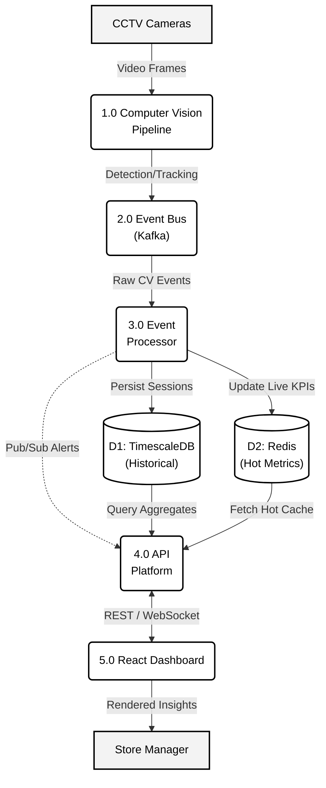
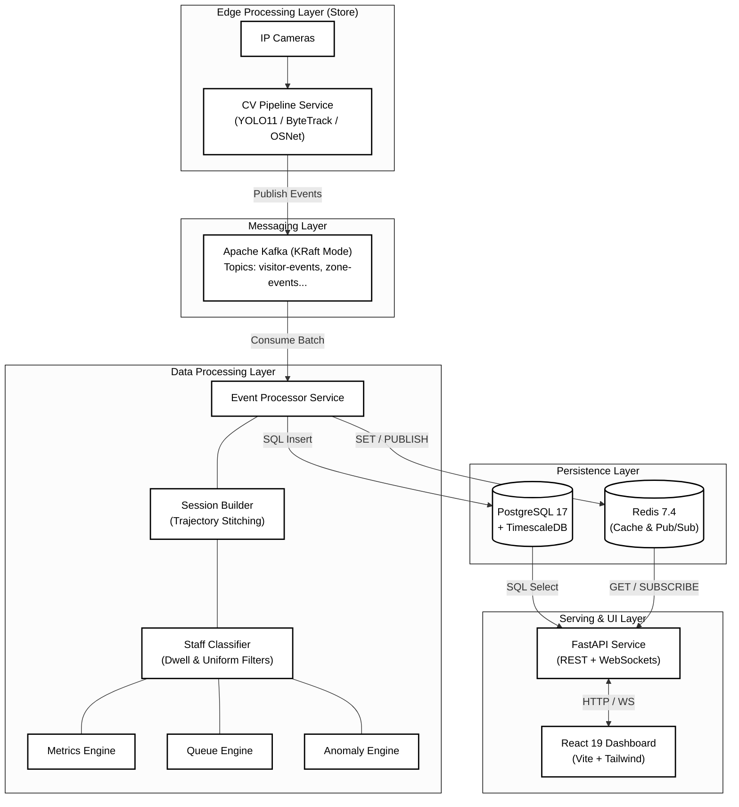

# Store Intelligence Platform (SIP)

> AI-Powered Retail Analytics — Transforming CCTV footage into real-time business intelligence.


## Architecture & Data Flow

### 1. Data Flow Diagram (DFD)


### 2. System Architecture


## Quick Start

### Prerequisites

- Docker & Docker Compose
- (Optional) NVIDIA GPU + nvidia-container-toolkit for CV pipeline

### 1. Setup Environment

```bash
cp .env.example .env
# Edit .env with your configuration
```

### 2. Start Services

```bash
# Development mode
docker compose -f docker-compose.yml -f docker-compose.dev.yml up -d

# Create Kafka topics
docker compose exec kafka bash /opt/kafka/create-topics.sh
```

### 3. Verify

```bash
# Check service health
curl http://localhost:8000/api/v1/health

# Open dashboard
open http://localhost:3000

# View Grafana
open http://localhost:3001
```

### 4. Simulate Events

```bash
python scripts/simulate_video.py --events 1000 --kafka localhost:9094
```

## Services

| Service | Port | Description |
|:--------|:-----|:------------|
| **API** | 8000 | FastAPI REST + WebSocket |
| **Dashboard** | 3000 | React + TailwindCSS |
| **Grafana** | 3001 | Monitoring dashboards |
| **Prometheus** | 9090 | Metrics collection |
| **PostgreSQL** | 5432 | TimescaleDB (time-series) |
| **Redis** | 6379 | Cache + Pub/Sub |
| **Kafka** | 9092/9094 | Event streaming (KRaft) |

## API Endpoints

| Method | Endpoint | Description |
|:-------|:---------|:------------|
| POST | `/api/v1/events/ingest` | Batch event ingestion |
| GET | `/api/v1/stores/{id}/metrics` | Store KPIs |
| GET | `/api/v1/stores/{id}/funnel` | Conversion funnel |
| GET | `/api/v1/stores/{id}/heatmap` | Zone activity heatmap |
| GET | `/api/v1/stores/{id}/anomalies` | Active anomalies |
| GET | `/api/v1/health` | System health check |
| WS | `/api/v1/ws/dashboard/{id}` | Real-time dashboard stream |

## Technology Stack

| Layer | Technology |
|:------|:-----------|
| Detection | YOLO11 (Ultralytics) |
| Tracking | ByteTrack |
| Re-ID | OSNet (TorchReID) |
| Streaming | Apache Kafka 4.0 (KRaft) |
| Backend | FastAPI (async) |
| Database | PostgreSQL 17 + TimescaleDB |
| Cache | Redis 7.4 |
| Frontend | React 19 + TailwindCSS 4 |
| Monitoring | Prometheus + Grafana |

## Core Subsystems

### 1. Session Builder & Tracking
Rather than raw box counts, the pipeline aggregates events into comprehensive visitor sessions.
* **Embeddings**: OSNet extracts appearance embeddings upon entry.
* **Re-identification**: When a visitor leaves a camera's FoV and enters another, cosine similarity is used to stitch the trajectories into a unified session.

### 2. Staff Classification Engine
To ensure pristine conversion metrics, retail staff must not be counted as visitors.
The Staff Classifier applies a scoring heuristic:
* **Uniform Detection**: Color histogram matching against known brand uniforms.
* **Behavioral Patterns**: Extended dwell time (8+ hours) and high frequency in the Point-of-Sale (POS) zone.
* **Result**: Staff trajectories are flagged `is_staff=true` and excluded from funnel analytics.

### 3. Anomaly Engine Mathematics
Anomalies are detected using real-time statistical deviations rather than hardcoded thresholds:
* **Queue Spike**: Triggers if `current_queue_depth > rolling_mean_1h + (3 * std_dev)`.
* **Conversion Drop**: Triggers if `daily_conversion_rate < 7_day_moving_average - (2 * std_dev)`.
* **Dead Zone**: Triggers if `time_since_last_entry(zone_id) > 30 minutes` during peak operating hours.

## Data Models & Event Schema

### Standardized JSON Event Schema
Events published from the Edge CV pipeline to Kafka follow a strict structure:
```json
{
  "event_id": "evt_987654321",
  "store_id": "str_xyz123",
  "camera_id": "cam_04",
  "visitor_id": "vis_abc987",
  "event_type": "ZONE_ENTRY",
  "zone_id": "skincare_aisle",
  "timestamp": "2026-05-31T14:22:10Z",
  "confidence": 0.94,
  "embedding": [0.12, -0.45, ... 512d array]
}
```

## Security Posture

Enterprise-grade security is baked into the architecture:
* **Authentication**: FastAPI utilizes standard OAuth2 with JWT Bearer tokens for all dashboard APIs.
* **Authorization (RBAC)**: Strict Role-Based Access Control (`Store Manager` vs `Regional Admin`). Managers can only fetch data where `store_id` matches their allowed region.
* **Edge Security**: Edge camera nodes authenticate with the Kafka broker using mTLS (Mutual TLS).
* **Rate Limiting**: Redis-backed rate limiters (`100 req/min`) protect public-facing endpoints from abuse.

## North Star Metric

```
Store Conversion Rate = Converted Visitors / Total Unique Visitors
```

## Development

```bash
# Run tests
make test

# Run specific service tests
make test-api
make test-cv

# View logs
make logs

# Database shell
make db-shell
```

## License

Proprietary — All rights reserved.
