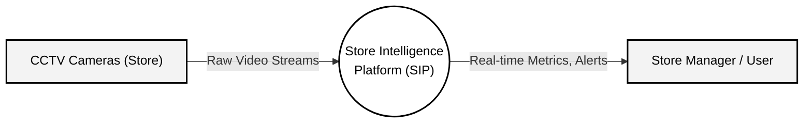
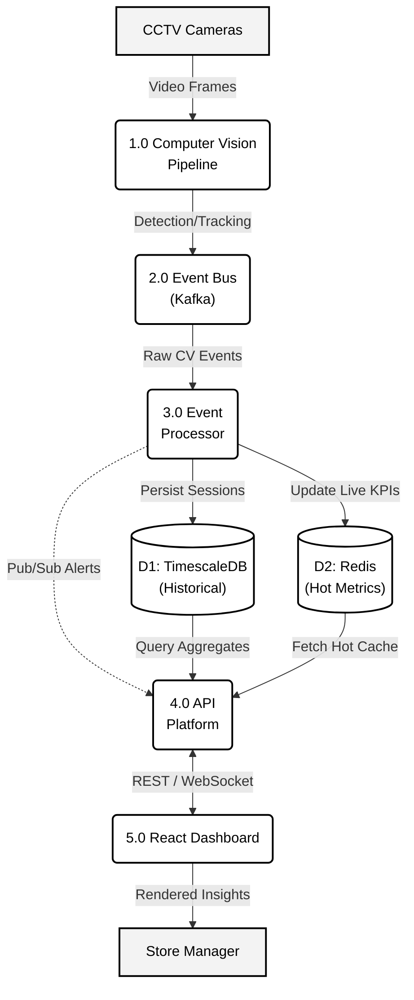
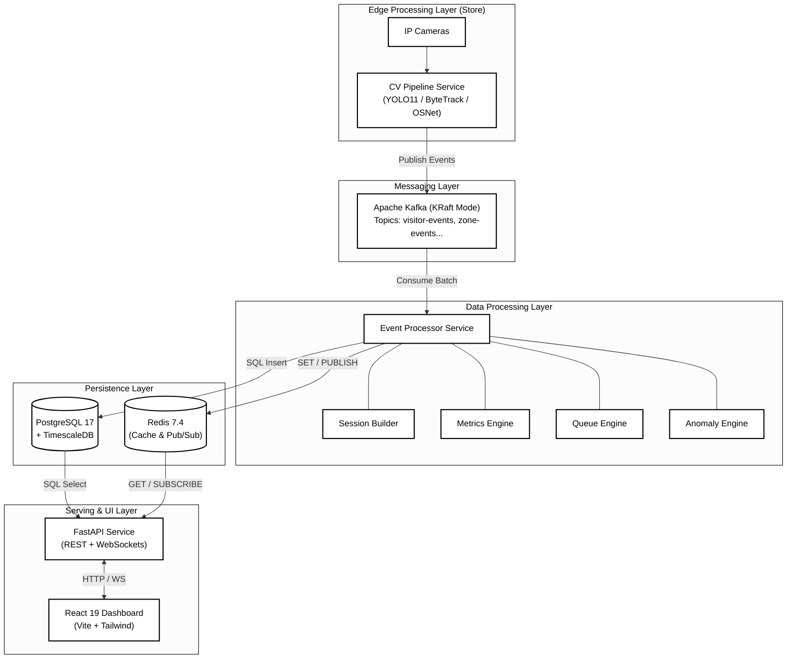

# Store Intelligence Platform (SIP) — Architecture & DFD

This document outlines the formal system architecture, data flows, and component specifications for the Store Intelligence Platform. All diagrams have been styled in a clean, high-contrast monochrome (black and white) aesthetic for professional documentation purposes.

---

## 1. Context Data Flow Diagram (Level 0)

The Level 0 Context DFD illustrates how the SIP interacts with external entities. It abstracts the entire system into a single process node to show the boundary of the platform.

> [!NOTE]
> The dashed borders indicate external entities outside the direct processing control of the platform.

---

## 2. Detailed Data Flow Diagram (Level 1)

The Level 1 DFD breaks down the SIP process into its major logical subsystems, illustrating how data is transformed from raw pixels into business intelligence.

---

## 3. System Architecture Diagram

This structural architecture diagram maps the physical/deployment topology of the microservices, messaging layers, and data stores.

---

## 4. Component Specifications

### 4.1 Edge Processing (Computer Vision)
- **Responsibility**: Ingests RTSP streams at 20+ FPS, runs inference, and abstracts pixels into logical events.
- **Key Algorithms**:
  - **Detector**: YOLO11 (Object Detection) isolating `class 0` (person).
  - **Tracker**: ByteTrack (Multi-Object Tracking) for frame-to-frame persistence.
  - **Re-ID**: OSNet (Appearance Features) extracting 512-D vectors for cross-camera re-identification.
  - **Zones**: Ray-casting point-in-polygon logic for geographical boundary detection.

### 4.2 Messaging Layer (Kafka KRaft)
- **Responsibility**: Decouples the GPU-heavy edge devices from the analytical backend, buffering spikes in store traffic.
- **Topics**: `visitor-events`, `zone-events`, `queue-events`, `conversion-events`, `dashboard-events`.

### 4.3 Analytics Engines (Event Processor)
- **Responsibility**: Consumes raw Kafka streams concurrently and applies stateful transformations.
- **Sub-Engines**:
  - **Session Builder**: Tracks a single visitor's journey (Entry -> Skincare -> Checkout -> Exit) into a unified timeline.
  - **Metrics Engine**: Computes conversion rates and unique visitor counts in real time.
  - **Queue Engine**: Uses spatial clustering (DBSCAN principles) to identify queue depths and wait times.
  - **Anomaly Engine**: Statistical rolling window (Standard Deviation) to detect 3σ spikes in queue depths or dead zones.

### 4.4 Data Persistence
- **TimescaleDB**: Optimizes PostgreSQL for time-series data. Stores raw historical logs and finalized visitor sessions. Uses Continuous Aggregates for hourly/daily rollups.
- **Redis**: Stores volatile, high-read-frequency data (current KPI numbers, active anomalies) and acts as the Pub/Sub broker for horizontal WebSocket scaling.

### 4.5 API & Presentation
- **FastAPI**: Asynchronous Python backend. Uses `asyncpg` for non-blocking DB queries and exposes a WebSocket Manager that subscribes to Redis to fan-out live updates.
- **React Dashboard**: Modern SPA. Connects to the WebSocket feed to trigger count-up animations, redraw Recharts area/line graphs, and push alert notifications without polling.

---

> [!TIP]
> This architecture is designed for **horizontal scalability**. If processing load increases (e.g., adding more stores), you can independently scale the CV Pipeline instances (Edge) and Event Processor instances (Cloud), relying on Kafka's consumer groups to balance the event load automatically.
